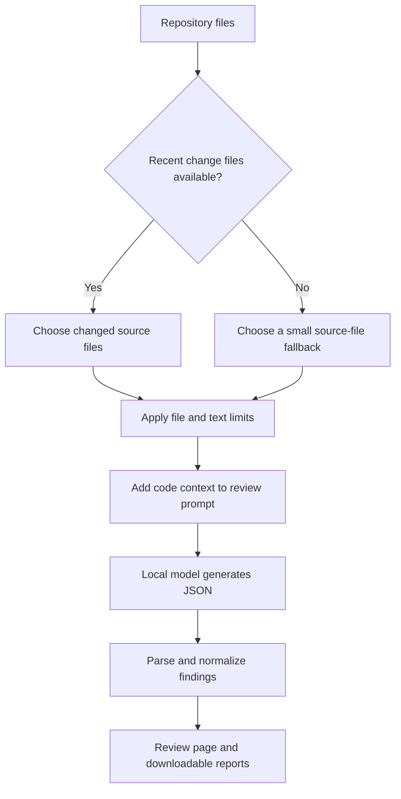

# Local LLM Code Review Assistant

**Project by Meghana**

## Project Overview

The Local LLM Code Review Assistant analyzes a GitHub repository with an open-source language model running on the user's machine. The application gathers a limited amount of repository code as context, sends it to the locally hosted model through Ollama, and presents structured findings in a web interface.

The project is designed around privacy, practical code-review feedback, and an accessible review workflow. The current prototype uses a lightweight retrieval-augmented approach: it selects files from recent repository changes and supplies their contents to the model as context. The model is adapted to this task through instructions and output formatting; the current implementation does not fine-tune the model or use a vector database for semantic search.

| Project detail | Current implementation |
|---|---|
| Application | Local LLM Code Review Assistant |
| Author | Meghana |
| Local inference runtime | Ollama |
| Default model | `llama3.2` |
| Web client | React, TypeScript, Vite |
| API server | Python, FastAPI |
| Main input | Public GitHub repository URL and branch |
| Main outputs | Structured findings, PDF report, JSON report |

## Goals

- Review code with a locally running open-source language model.
- Provide repository summaries and actionable issue descriptions.
- Organize findings by severity and category.
- Make review results accessible through a browser-based dashboard.
- Keep repository analysis on the local machine during inference.

## How It Works

```mermaid
flowchart LR
    A[Enter GitHub URL and branch] --> B[Python API clones repository]
    B --> C[Collect recent changed files]
    C --> D[Select and bound code context]
    D --> E[Build review prompt]
    E --> F[Ollama runs llama3.2 locally]
    F --> G[Parse structured JSON findings]
    G --> H[Display summary and issues]
    H --> I[Download PDF or JSON]
```



### Retrieval-Augmented Review Flow

| Stage | What happens |
|---|---|
| Repository input | The user supplies a GitHub repository URL and a branch name. |
| Retrieval | The API clones the repository and checks its recent changes. It selects changed source files, with a fallback to a small set of source files when no changed files are available. |
| Context limits | The prototype limits the number and size of code snippets sent to the model to keep requests bounded. |
| Generation | A task-specific prompt asks the local model for an overview, review summary, detected technologies, and issues in JSON format. |
| Presentation | The API normalizes severity counts and returns the results to the React interface. |

This is a lightweight, file-based retrieval workflow. It does not currently create embeddings, maintain a vector index, or retrieve semantically similar code chunks. The model is a pretrained open-source model used locally, not a model fine-tuned by this project.



## Features

| Area | Included in the current application |
|---|---|
| Repository review | Submit a GitHub repository URL and choose a branch. |
| Local inference | Send review prompts to Ollama at `http://localhost:11434`. |
| Code context | Analyze a bounded selection of recent changed files or fallback source files. |
| Review summary | Show a generated repository overview, review summary, and detected technologies. |
| Findings | Present issue titles, details, categories, and severity levels. |
| Filtering | Filter displayed findings by severity. |
| Export | Download a PDF report or JSON results. |
| Dashboard | View saved review counts and recent activity. |
| History | Search locally saved reviews by repository. |
| Analytics | View sample review-volume and severity visualizations. |

## Optional Jira Integration

The project's Python review pipeline can enrich a review with the Jira issue associated with the current branch. When configured, it extracts an issue key, fetches the issue title and description, and makes the issue URL and details available to the review and question-answering prompts. This gives the local model requirements context to compare with the code changes.

| Capability | Details |
|---|---|
| Branch key detection | Looks for an uppercase key followed by digits, such as `PROJ-123`. |
| Context retrieved | Jira issue title, description, and browse URL. |
| Review usage | Adds issue context to review summaries so implementation can be compared with the stated requirement. |
| Q&A usage | Makes the associated issue available when asking questions about a change. |
| Web interface | The current browser-based repository review endpoint does not yet connect to Jira; Jira context is available through the Python review pipeline. |

Configure the integration with environment variables before running the Python review pipeline:

| Variable | Required | Purpose |
|---|---|---|
| `JIRA_URL` | Yes | Jira base URL, such as `https://your-domain.atlassian.net`. |
| `JIRA_TOKEN` | Yes | Jira API token or supported personal access token. |
| `JIRA_USER` | No | Jira account email/username for basic authentication; omit it when using token-only authentication. |

Example branch names include `feature/PROJ-123-add-login` and `bugfix/APP-42-timeout`. Keep project keys uppercase and include the key as a distinct branch-name token. Store tokens in environment variables or a secret manager, never in source control, and use an account with only the Jira permissions required to read the relevant issues.

## Severity Levels

The model is prompted to use a four-level scale. These are AI-generated suggestions and should be checked by a developer before acting on them.

| Level | Meaning |
|---|---|
| Critical | A potentially severe problem that should be investigated immediately. |
| High | A significant issue with substantial impact or risk. |
| Medium | A meaningful issue that should be addressed during normal development. |
| Low | A minor improvement or lower-impact concern. |

## Web Interface Guide

| Page | Purpose |
|---|---|
| Home | Introduces the review workflow and links to the main application pages. |
| Repository Review | Accepts the repository URL and branch, starts analysis, displays findings, and exports reports. |
| Dashboard | Summarizes locally saved review activity and provides navigation shortcuts. |
| Review History | Searches reviews saved in the browser for the signed-in user. |
| Analytics | Shows review and severity charts. Current chart values are demonstration data. |
| Sign in / Sign up | Provides the prototype's account screens. Account and review-history behavior is client-side and is not a production authentication system. |

### Running a Review

1. Start Ollama and make sure the configured model is available locally.
2. Start the Python API server and the web development server using the setup steps below.
3. Open the web interface and go to **Repository Review**.
4. Enter a public GitHub repository URL, such as `https://github.com/owner/repository`.
5. Enter the branch to analyze, then choose **Start analysis**.
6. Review the generated overview, summary, and severity-classified findings.
7. Use the report controls to download PDF or JSON output.

When signed in through the prototype UI, completed review data is saved in browser `localStorage` for that user. Clearing browser storage removes that local history.

## Technology Overview

| Component | Technology | Responsibility |
|---|---|---|
| Frontend | React 19 and TypeScript | Review screens, navigation, local history, and report export |
| Frontend tooling | Vite | Local development server and production build |
| API | FastAPI and Pydantic | Review request handling and JSON response validation |
| Repository access | Git command-line client | Clone public repositories, check out branches, inspect recent changes |
| Local model runtime | Ollama | Host the model and serve chat completions locally |
| PDF output | jsPDF and jsPDF-AutoTable | Generate downloadable review reports |

## Setup

### Prerequisites

| Requirement | Use |
|---|---|
| Python 3.11 or newer | Run the API server |
| Node.js LTS and npm | Install and run the web client |
| Git | Clone the repository being reviewed |
| Ollama | Run local model inference |
| `llama3.2` model | Default model requested by the API |

The current API uses a Windows temporary directory (`C:\\g`) for cloned repositories, so this setup is Windows-oriented.

### 1. Prepare Ollama

Install Ollama, then download the model used by the API:

```powershell
ollama pull llama3.2
```

Keep the Ollama service running. The API sends OpenAI-compatible chat requests to `http://localhost:11434/v1/chat/completions`.

### 2. Start the API Server

In a terminal, move into the API directory and install its dependencies:

```powershell
cd web-interface/server
python -m venv .venv
.venv\Scripts\Activate.ps1
python -m pip install -r requirements.txt
python -m pip install httpx python-dotenv
python main.py
```

The API listens on `http://localhost:8000`. The extra install line includes the HTTP client and environment-file package imported by the current server implementation.

### 3. Start the Web Interface

Open a second terminal at the project root:

```powershell
cd web-interface
npm install
npm run dev
```

Open the local URL printed by Vite, usually `http://localhost:5173`.

## API Endpoints

| Method | Endpoint | Purpose |
|---|---|---|
| `GET` | `/` | API name and version response |
| `GET` | `/health` | Basic server health check |
| `POST` | `/api/review` | Clone and analyze a GitHub repository branch |
| `GET` | `/api/reviews/history` | Returns sample review-history data |
| `GET` | `/api/analytics` | Returns sample analytics data |

Example review request:

```json
{
  "repo_url": "https://github.com/owner/repository",
  "branch": "main"
}
```

## Privacy and Security

- Model inference is sent to the local Ollama service, not to a hosted model provider.
- Repository contents are cloned to a temporary local directory for analysis and removed after the request completes.
- The web review flow currently clones public GitHub repositories; private repository credentials are not configured by the UI.
- The API accepts repository URLs and invokes Git, so run it only in a trusted local environment.
- Browser review history is stored in `localStorage`; it is not a secure or synchronized database.
- Findings are generated by a language model and can be incomplete or incorrect. Validate them against the source code.

## Current Limitations

| Limitation | Current behavior |
|---|---|
| Retrieval method | File/change selection rather than embedding-based semantic retrieval. |
| Model adaptation | Prompt and response-format adaptation; no project-specific fine-tuning. |
| Repository access | The web flow supports public GitHub URLs and a branch name. |
| Analysis scope | The server bounds the number and size of files passed to the model. |
| Finding locations | The current API response does not map generated findings to precise source line numbers. |
| Authentication | Prototype account screens; browser-side storage is not production authentication. |
| Analytics | Current analytics views contain sample data and should not be treated as live metrics. |
| Operating system | The API temporary path is currently Windows-specific. |

## Future Improvements

- Add embedding-based retrieval and a vector store for semantic code search.
- Support configurable local models and model settings.
- Add authenticated access for private repositories.
- Persist review history and analytics in a backend database.
- Include validated file paths and line references in each finding.
- Add automated tests for repository cloning, inference, and report generation.
- Make temporary-file handling configurable across operating systems.

## Development Checks

From `web-interface/`, run the frontend production build and lint checks:

```powershell
npm run build
npm run lint
```

The API can be checked while running with:

```powershell
Invoke-RestMethod http://localhost:8000/health
```

---

**Created by Meghana**